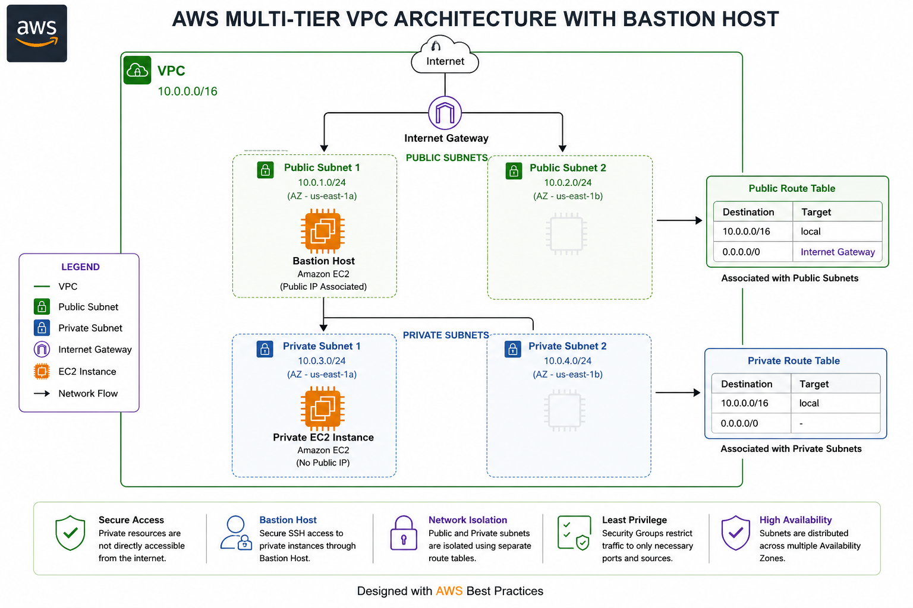
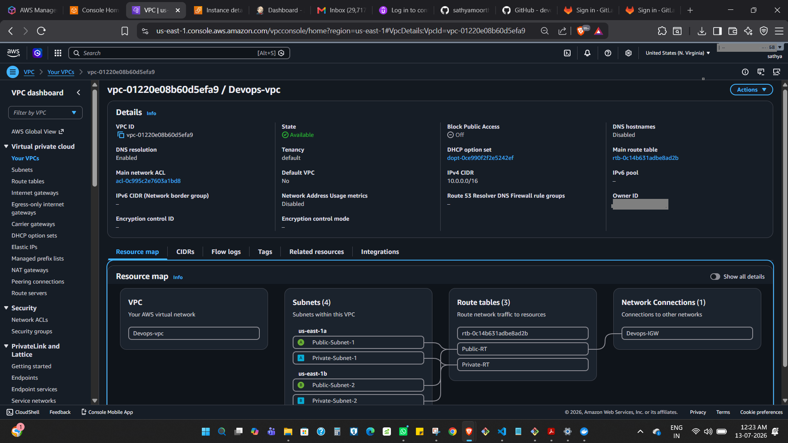
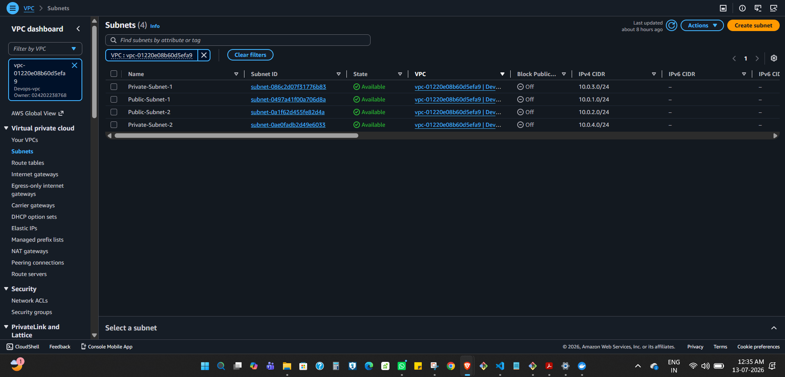
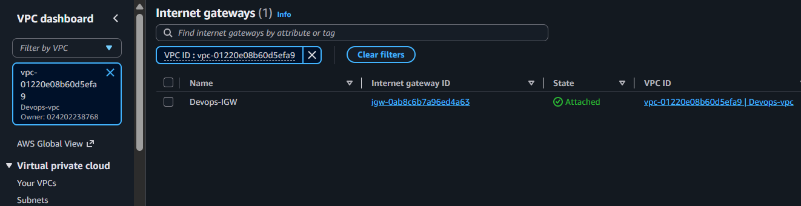
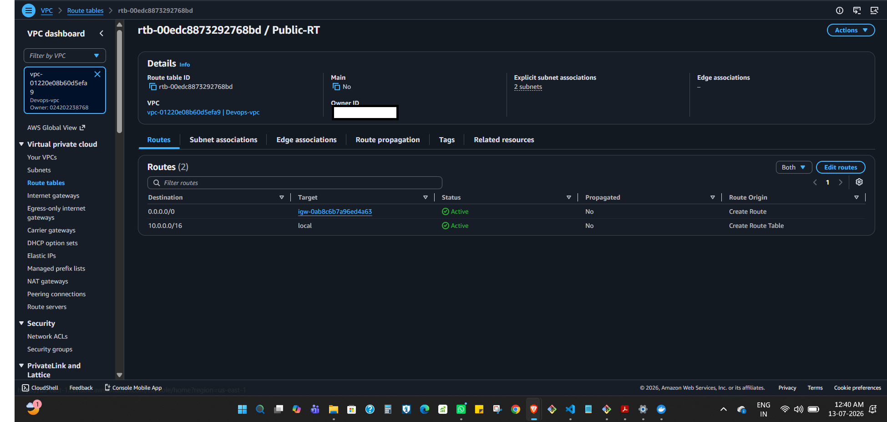
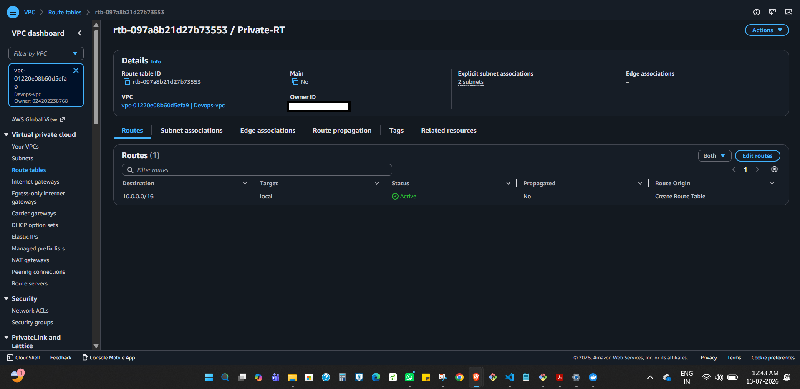
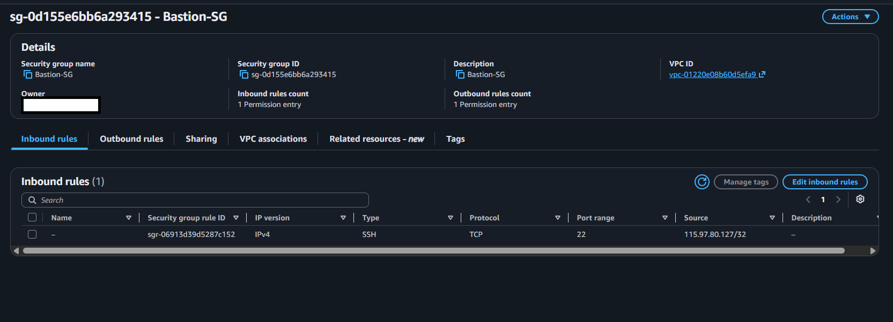
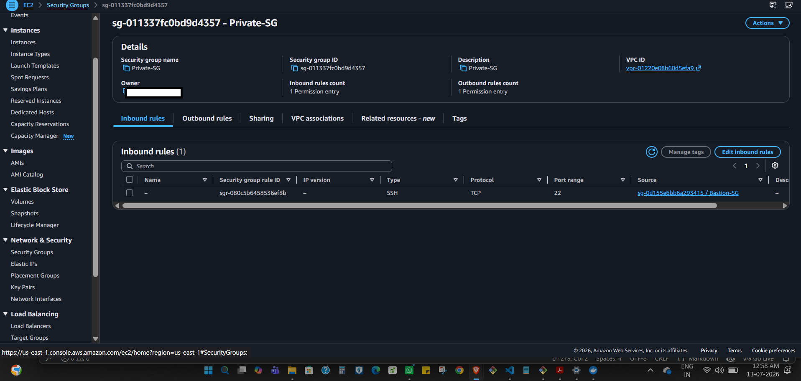
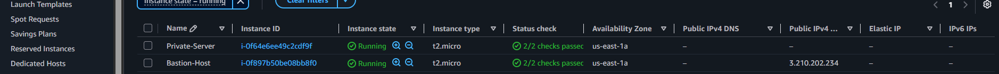
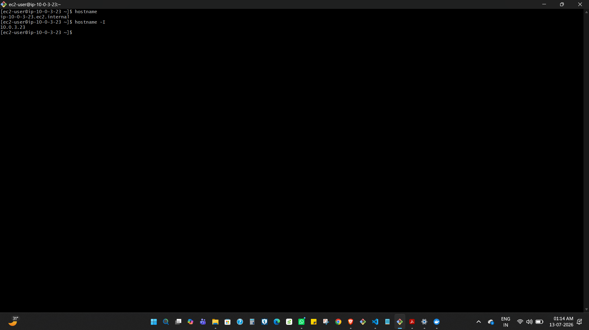

# AWS Multi-tier VPC Architecture with Bastion Host


> **A production-inspired AWS networking project demonstrating secure infrastructure design using a multi-tier VPC architecture and Bastion Host access.**

---

## 📌 Project Overview

This project demonstrates the design and implementation of a secure **multi-tier AWS Virtual Private Cloud (VPC)** following AWS networking best practices.

The infrastructure was designed using **two public subnets and two private subnets** distributed across **two Availability Zones**. A Bastion Host deployed in the public subnet provides secure SSH access to EC2 instances hosted in private subnets without exposing them directly to the internet.

The project showcases practical implementation of AWS networking concepts including VPC design, subnetting, route tables, security groups, Internet Gateway configuration, and secure administration of private infrastructure.

---

## 🎯 Project Objectives

- Design a secure AWS Virtual Private Cloud (VPC)
- Implement a multi-tier network architecture
- Deploy public and private subnets across multiple Availability Zones
- Secure private EC2 instances using a Bastion Host
- Follow AWS networking and security best practices

---

## 💻 Skills Demonstrated

- Amazon VPC
- Amazon EC2
- VPC Networking
- CIDR Planning
- Public & Private Subnets
- Route Tables
- Internet Gateway
- Security Groups
- Bastion Host
- SSH
- Amazon Linux 2023
- AWS Networking Best Practices

---

## 🏗 Architecture

The following diagram illustrates the AWS Multi-tier VPC Architecture implemented in this project.



---

## ⚙️ Infrastructure Specifications

| Component | Configuration |
|------------|---------------|
| VPC CIDR | 10.0.0.0/16 |
| Availability Zones | 2 |
| Public Subnets | 2 |
| Private Subnets | 2 |
| Internet Gateway | 1 |
| Public Route Table | 1 |
| Private Route Table | 1 |
| Bastion Host | Amazon Linux 2023 |
| Private EC2 | Amazon Linux 2023 |
| Security Groups | 2 |

---

## 🛠 AWS Services Used

| AWS Service | Purpose |
|-------------|---------|
| Amazon VPC | Created an isolated virtual network |
| Amazon EC2 | Hosted the Bastion Host and Private EC2 instance |
| Internet Gateway | Enabled internet connectivity for public subnets |
| Route Tables | Controlled network traffic routing |
| Security Groups | Controlled inbound and outbound traffic |
| Amazon Linux 2023 | Operating system for EC2 instances |
| Secure Shell (SSH) | Secure remote administration |

---

## 🏛 Infrastructure Design

The infrastructure follows a secure **multi-tier network architecture** that separates internet-facing resources from private workloads.

- Created a custom VPC with CIDR block **10.0.0.0/16**
- Deployed **two Public Subnets** and **two Private Subnets**
- Distributed subnets across **two Availability Zones**
- Attached an Internet Gateway for internet connectivity
- Configured separate Public and Private Route Tables
- Deployed a Bastion Host inside the public subnet
- Launched a Private EC2 instance without a public IP address
- Allowed SSH access to the private instance only through the Bastion Host
- Restricted network access using Security Groups following the Principle of Least Privilege

---

## 🌐 Network Flow

```text
Internet
    │
Internet Gateway
    │
Public Route Table
    │
Public Subnet
    │
Bastion Host
    │
Private Route Table
    │
Private Subnet
    │
Private EC2 Instance
```

---

## 🔒 Security Design

```text
Local Machine
      │
 SSH (Port 22)
      │
Bastion Host
      │
 SSH via Private IP
      │
Private EC2 Instance
```

### Security Group Configuration

| Security Group | Inbound Rule |
|----------------|--------------|
| Bastion Host SG | SSH (22) from My IP |
| Private EC2 SG | SSH (22) only from Bastion Host Security Group |

This design ensures that the private EC2 instance is never directly exposed to the public internet.

---

## ✨ Key Features

- Designed a custom AWS VPC from scratch
- Implemented public and private subnet architecture
- Configured Internet Gateway and Route Tables
- Secured infrastructure using Security Groups
- Deployed a Bastion Host for secure SSH access
- Prevented direct internet access to private EC2 instances
- Implemented secure communication using private IP addresses
- Followed AWS networking and security best practices

---

## 🚀 Implementation Steps

1. Created a custom VPC with CIDR block `10.0.0.0/16`
2. Created two Public Subnets and two Private Subnets across two Availability Zones
3. Attached an Internet Gateway to the VPC
4. Configured separate Public and Private Route Tables
5. Associated the Public Route Table with the Public Subnets
6. Associated the Private Route Table with the Private Subnets
7. Deployed a Bastion Host in the Public Subnet
8. Launched a Private EC2 instance without a Public IP
9. Configured Security Groups for controlled SSH access
10. Verified secure SSH connectivity:

```text
Local Machine
      ↓
Bastion Host
      ↓
Private EC2 Instance
```

---

## ✅ Testing & Validation

The following validations were successfully completed:

- ✅ Bastion Host accessible from the internet
- ✅ Private EC2 not accessible directly from the internet
- ✅ SSH access verified through the Bastion Host
- ✅ Route Tables functioning correctly
- ✅ Security Groups tested successfully
- ✅ Private communication verified using private IP addresses

---

## 📸 Project Screenshots

### 1. Custom AWS VPC


### 2. Public & Private Subnets


### 3. Internet Gateway


### 4. Public Route Table


### 5. Private Route Table


### 6. Bastion Host Security Group


### 7. Private EC2 Security Group


### 8. EC2 Instances


### 9. SSH to Bastion Host


### 10. SSH to Private EC2


---

## 📁 Repository Structure

```text
.
├── README.md
├── architecture.png
└── screenshots
    ├── 01-vpc.png
    ├── 02-subnets.png
    ├── 03-internet-gateway.png
    ├── 04-public-route-table.png
    ├── 05-private-route-table.png
    ├── 06-bastion-security-group.png
    ├── 07-private-security-group.png
    ├── 08-ec2-instances.png
    ├── 09-ssh-bastion.png
    └── 10-ssh-private-server.png
```

---

## 🎓 Skills Gained

- Designed and deployed a secure AWS Virtual Private Cloud
- Planned CIDR blocks and subnet architecture
- Configured Internet Gateway and Route Tables
- Implemented secure network isolation using Public and Private Subnets
- Applied the Principle of Least Privilege using Security Groups
- Implemented secure administration of private EC2 instances using a Bastion Host
- Gained practical experience with AWS networking best practices

---

## ⭐ AWS Best Practices Followed

- Multi-tier network architecture
- Public and Private subnet isolation
- Multi-Availability Zone deployment
- Principle of Least Privilege
- Bastion Host for administrative access
- No Public IP assigned to private workloads
- Security Group-based access control
- Secure SSH communication using private IP addresses

---

## 🔮 Future Enhancements

- Add a NAT Gateway for outbound internet access from private subnets
- Deploy an Application Load Balancer (ALB)
- Configure Auto Scaling Groups
- Provision the infrastructure using Terraform
- Implement monitoring with Amazon CloudWatch
- Integrate the infrastructure into a Jenkins CI/CD pipeline

---

## 👨‍💻 Author

**Sathya Moorthy S**

Cloud & DevOps Enthusiast

If you found this project useful, consider giving it a ⭐.

---

## 📄 License

This project is intended for learning and portfolio purposes.